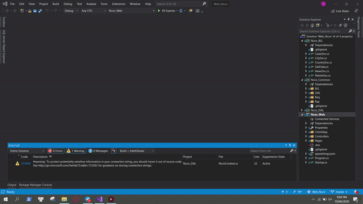
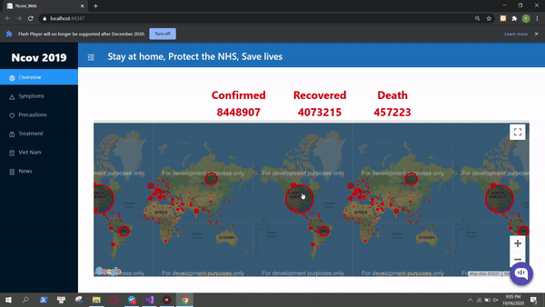
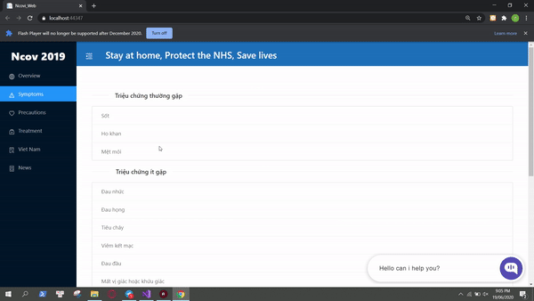
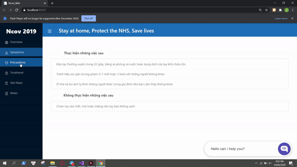
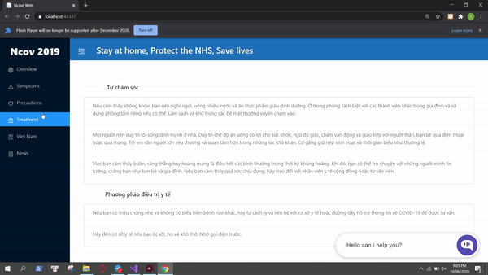
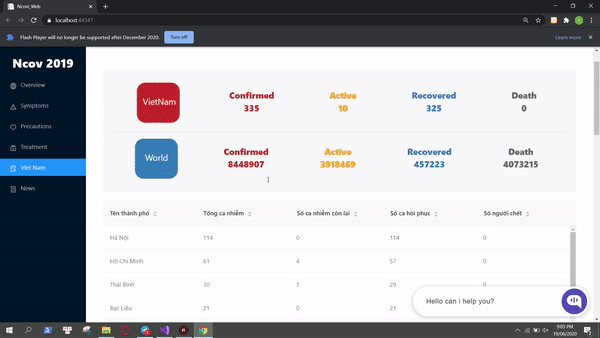
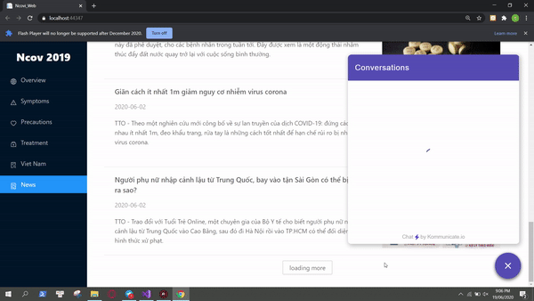

# Welcome to WebNcov!

The website provides information on the situation of the COVID disease

## Prerequisite
#### For the server-side
- .NET core >= 3.1
- SQL Server >= 2017
#### For the cline-side
- NPM >= 6.13.4
- NODE >= v12.16.1
- REACT >= 16.13.1

## Install
**node**
Follow this [link](https://nodejs.org/dist/v12.18.0/node-v12.18.0-x64.msi)
> npm install

## Usage
Start up

Overview

Symptoms

Precautions

Treatment

Viet Nam

News

Bot

## Data Sources:
* Aggregated data sources:
  * Covid19 API: [https://covidapi.info/](https://covidapi.info/)
* Viet Nam data sources:
  * BỘ Y TẾ TRANG TIN VỀ DỊCH BỆNH VIÊM ĐƯỜNG HÔ HẤP CẤP COVID-19: [https://ncov.moh.gov.vn/](https://ncov.moh.gov.vn/)
## Features
Data visualation ncov

Rest API

Chat-bot support user provide  Covid information(dialogflow)

## Author
*  Hồ Tấn Tài   (Chat-Bot, Web design)
* Hồng Thanh Thuận (Front-End)
* Nguyễn Đỗ Tuấn Kiệt (Back-End)

## Demo
Click the [link](https://ncovweb.azurewebsites.net/) to see web demo

